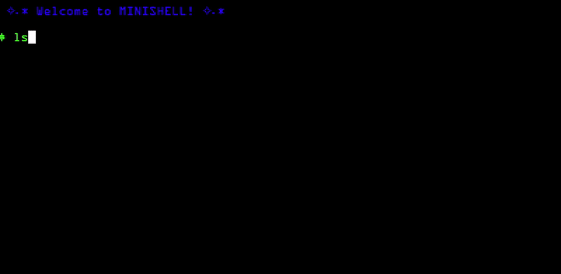

# 𖦹 Minishell 𖦹

Minishell is an interactive command interpreter mimicing the behavior of the widely used shell implementation, bash.



## Project topics
- Pipes
- Signal handling
- Forking and child management
- System calls

## Installation and Compilation

1. Clone the repository with the following command:

    ``` git clone https://github.com/jelloster/minishell.git ```

2. Navigate inside the repository and compile with make

    ``` make ```

## Running the program

Simply run the program with the following command:

  ```./minishell ```

